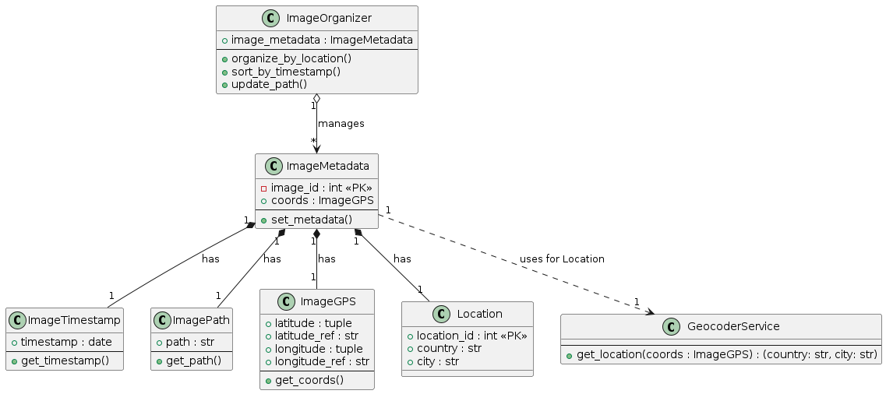

# image-sorter

📷 Image Sorter & Organizer
Project Overview
This project provides an solution for managing and organizing large, unsorted collections of digital images. Leveraging the EXIF metadata embedded in modern photographs, the system intelligently sorts images into a logical folder hierarchy based on when and where the picture was taken.

The goal is to transition my chaotic image archive into an easily navigable structure, eliminating the time spent manually filing photos.

The Problem This Project Solves
Today's digital cameras and smartphones embed rich metadata (EXIF data)—including GPS coordinates and precise timestamps—directly into image files. Unfortunately, these files are often dumped into a single, massive folder, making it impossible to quickly find a photo based on a trip or event.

This project solves the challenge of filing a large collection of photos by automatically extracting and organizing metadata from the files, creating a logical folder hierarchy based on the location and time of each photo.

Key Features
Metadata Extraction: Automatically reads and interprets essential EXIF data (timestamp and GPS coordinates) from image files.

Geotagging & Location Resolution: Uses GPS coordinates to resolve and identify the corresponding country and city.

Automated Reorganization: Creates a structured, hierarchical folder system (e.g., Country/City/Year/Month) on your hard drive.

File Relocation: Moves image files into their corresponding, newly created location- and time-based folders, preserving the original file integrity.

As a User, I need a simple tool that scans a designated folder, extracts the location and time data from images, and automatically sorts them into a hierarchical folder structure based on Time and Location.

The extracted metadata will be stored in a Postgres database. his is simply for learning purposes and not for production use.

#### If you clone this repo, edit the image_dir variable in image_dir_path here:
**src/utils/image_dir_path.py**

### Goals:

**1. Metadata Extraction:** Efficiently read and parse EXIF data from every image file, specifically extracting the image path, timestamp, and GPS coordinates.

**2. Geocoding:** Convert the raw GPS coordinates (Latitude/Longitude) into a human-readable City and Country/Region name.

**3. Classification & Tracking:** Store a persistent record of the image's original location, its extracted data, and its new, intended file path.

**4. Idempotent Operation:** The system must be able to re-scan the folder without reprocessing or moving images that have already been classified and organized.

**5. Database Persistence:** The system must be able to store a persistent record of the image's metadata.

### Class Diagram

 
### My learning goals for this project

* Learn Python Object Oriented Programming
* Learn how to set up a Postgres database
